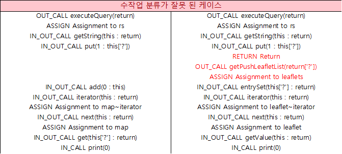

Fortify의 Data Flow 데이터를 이용하여 약점 군집화하기
========
[Fortify](https://www.microfocus.com/en-us/solutions/application-security)를 이용하여 취약점을 분석하면 다수의 발견사항(오탐 포함)으로 인해 많은 시간이 소요된다. 수작업 분석 과정 중 일부라도 자동화할 수 있다면 해당 시간은 단축될 수 있다. Data Flow 유사성 판단을 자동화하여 기존 수작업 분석 시간을 단축 가능한 방법을 찾아보았다. (실제 1/3 이하로 단축 가능)
# Fortify에서 수작업 분석 방법
Fortify 분석 결과(약점)가 실제 공격이 가능한지(취약점) 수작업으로 구분/분석하는 업무는 전체 코드를 검토하면 많은 시간이 소요되어, 취약한 코드의 Data flow 유사성(아래 그림의 Analysis Trace 내용)을 참고하여 취약 여부를 판단하곤 한다. (servlet filter에 보안필터가 적용되어 있어 검토할 필요없이 양호하거나, 코드로직 내부/외부 뷰 페이지에 커스텀 보안필터가 있을 경우가 있어 전체 코드를 보아야 하는 경우가 예외적으로 존재한다.)
사람의 판단에 의해 Data Flow의 유사성을 구분하는 것이 아니라 통계기법(kmeans)를 이용하여 기계적으로 구분하는 방법을 적용해보았다.
# Fortify의 분석 화면과 Data Flow 데이터 샘플

TODO: 데이터 추가 필요
# Data Flow 데이터 추출
[Fortify SSC의 API](https://github.com/fortify/ssc-restapi-client)를 이용하면 Fortify의 Data Flow 데이터를 추출할 수 있으며, 취약점 유형 중 XSS를 대상으로 테스트하였다.
[Fortify의 TraceNode Data](https://github.com/fortify/ssc-restapi-client/blob/master/docs/TraceNodeDto.md) 중에서  데이터 중 nodeType(IN_CALL 등), text(savePointJsonp 등)만 추출하여 아래와 같이 데이터를 구성한다. 2개의 프로젝트에서 XSS와 관련된 Data flow만 추출(파일 [fortify_ml.xlsx](./data/fortify_ml.xlsx), [fortify_ml2.xlsx](./data/fortify_ml2.xlsx))하였고, 수작업으로 확인한 취약여부 데이터를 추가하였다. (file경로와 이름은 군집화하는 것에 도움이 안되는 것으로 경험 상 판단했다.)
```text
EXTERNAL_ENTRY Spring Method Mapping URL 
IN_CALL savePointJsonp(2)
IN_OUT_CALL getCallback(this : return)
RETURN Return
```
# 최적의 k값 결정
Fortify에 의해 발견된 약점 중 약 1/3의 수를 K값으로 하면 최근 3개의 프로젝트에서 수작업으로 구분한 타입과 가장 유사하게 구분가능한 k값이 되었다. 하나의 프로젝트에서는 위와 같은 K값을 결정할 수 있으나, 다른 프로젝트에서 모두 범용적으로 사용할 수 있는 K값 결정 로직이 필요했다.
사람의 구분이 잘못 되었던 데이터(앞과 뒤 내용은 동일하나 분석 내용이 길어...)와 사람의 의도와 다르게 기계가 같다고 구분한 데이터를 [테스트 데이터](./data/test.xlsx)로 만들었고, 분석하려는 프로젝트의 데이터에 검증용으로 추가하는 코드를 작성하였다.



# 한계점
위와 같은 방식으로 업무를 진행하면 아래와 같은 경우에서 오탐 케이스가 발생할 수 있다.
- Data Flow 분석만으로는 취약하나,악성코드가 실행 불가한 response type(json 등)이라 xss에 안전하다고 판단할 경우 (fortify 분석 기능으로 제거 불가능하다.)
- Fortify가 인지하지 못하는 커스텀 보안필터를 사용 (fortify option에 해당 보안필터를 추가하면 된다.)
실제 업무를 효율화하기 위해서는 kmeans 외에 다양한 취약점 종류에 적용 가능한 방법이 필요하다.
# 관련 연구
[joern doc](https://fabs.codeminers.org/papers/2011-woot.pdf), [joern code](https://github.com/octopus-platform/joern-tools/blob/master/tools/ml/joern-knn), [joern video](https://www.youtube.com/watch?v=Uy2FrUmO-2E) : 각 함수에서 사용한 API Symbol(Topic)의 사용 패턴을 분석하고, 확인된 취약점과 근거리의 함수를 취약점 후보로 분석함
# 기타
knn 알고리즘 설명 : https://kkokkilkon.tistory.com/14,  https://tariat.tistory.com/37
kmeans 알고리즘 설명 : https://lovit.github.io/nlp/machine%20learning/2018/03/21/kmeans_cluster_labeling/
약점과 취약점 설명 : 소스코드에 존재하는 잠재적 위험은 약점, 약점 중 침해 사고로 연결 되는 위험은 취약점